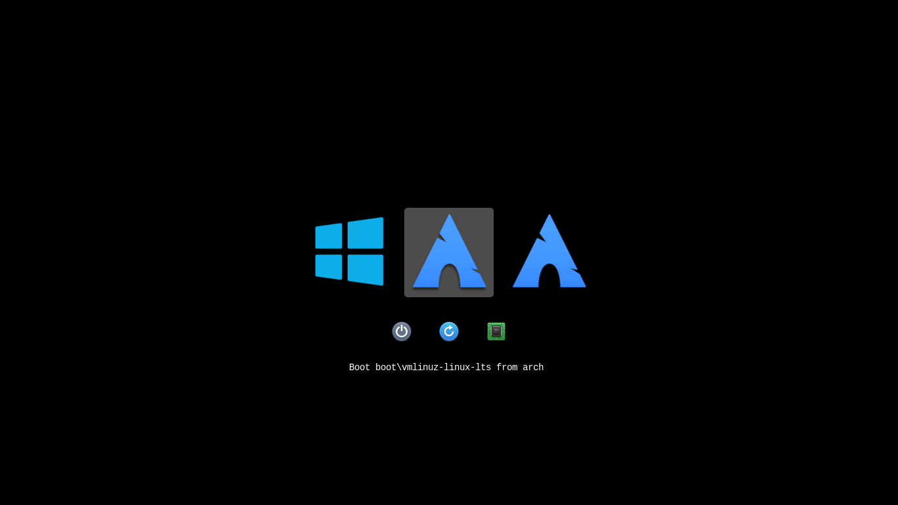

# elementary rEFInd theme

## Installation

You'll need the following dependencies:
* meson
* librsvg2-bin

Run `meson build` to configure the build environment and then change to the build directory

    meson build
    cd build

To install, use `ninja install`

    sudo ninja install
